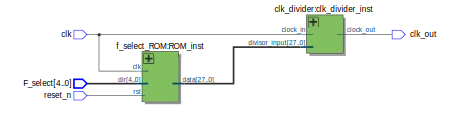

  

# Tiny Tapeout Verilog Project Template

- [Read the documentation for project](docs/info.md)

## Clock frequency Rivider ROM controled

This project is based on the necessity to have different clock frequencies for designing real-time clocks, using microprocessors, microcontrollers, or other devices.
# Block diagram

  

As we can see in the block diagram this project is compose of two parts, one being a ROM for frequency select, this ROM cointains the necesari parameters to divide the clock input. The second part is a counter to devide the input clk frequency.

## ROM
This ROM contains the nesesaria parameters to select the frequency needed out of 27 frecuencies, the calculus of parameters is base on the next formula:
`Divisor = clk_in / clk_out` 
Where:
- `clk_in` = Frequency of the input clock (in Hz)
- `clk_out` = Frequency of the output clock (in Hz)
- `DIVISOR` = Parameter value used to divide the input clock frequency
This parameter is the one we have on our rom this well drive our counter when we need to divide the frequency.
The next table enlist the parameters and frequencyies to be selected on the ROM:

| Address | Divider | Frequency (Hz) | Period |
| ------- | ------- | ---------------| ------ |
| 0       | 50,000,000 | 1             | 20ns   |
| 1       | 5,000,000  | 10            | 200ns  |
| 2       | 2,500,000  | 20            | 400ns  |
| 3       | 2,000,000  | 25            | 500ns  |
| 4       | 1,000,000  | 50            | 1us    |
| 5       | 500,000    | 100           | 2us    |
| 6       | 250,000    | 200           | 4us    |
| 7       | 200,000    | 250           | 5us    |
| 8       | 100,000    | 500           | 10us   |
| 9       | 66,667     | 750.005       | 13.333us|
| 10      | 50,000     | 1000          | 20us   |
| 11      | 5,000      | 10,000        | 100us  |
| 12      | 2,500      | 20,000        | 50us   |
| 13      | 2,000      | 25,000        | 40us   |
| 14      | 1,000      | 50,000        | 20us   |
| 15      | 665        | 75,188.7      | 13.307us |
| 16      | 500        | 100,000       | 10us   |
| 17      | 250        | 200,000       | 5us    |
| 18      | 200        | 250,000       | 4us    |
| 19      | 100        | 500,000       | 2us    |
| 20      | 65         | 769,231       | 1.3us  |
| 21      | 50         | 1,000,000     | 1us    |
| 22      | 12         | 4,166,667     | 0.24us |
| 23      | 10         | 5,000,000     | 0.2us  |
| 24      | 8          | 6,250,000     | 0.16us |
| 25      | 6          | 8,333,333     | 0.12us |
| 26      | 4          | 12,500,000    | 0.08us |
| 27      | 2          | 25,000,000    | 0.04us |

## Resources

- [FAQ](https://tinytapeout.com/faq/)
- [Digital design lessons](https://tinytapeout.com/digital_design/)
- [Learn how semiconductors work](https://tinytapeout.com/siliwiz/)
- [Join the community](https://tinytapeout.com/discord)
- [Build your design locally](https://docs.google.com/document/d/1aUUZ1jthRpg4QURIIyzlOaPWlmQzr-jBn3wZipVUPt4)

## What next?

- [Submit your design to the next shuttle](https://app.tinytapeout.com/).
- Edit [this README](README.md) and explain your design, how it works, and how to test it.
- Share your project on your social network of choice:
  - LinkedIn [#tinytapeout](https://www.linkedin.com/search/results/content/?keywords=%23tinytapeout) [@TinyTapeout](https://www.linkedin.com/company/100708654/)
  - Mastodon [#tinytapeout](https://chaos.social/tags/tinytapeout) [@matthewvenn](https://chaos.social/@matthewvenn)
  - X (formerly Twitter) [#tinytapeout](https://twitter.com/hashtag/tinytapeout) [@matthewvenn](https://twitter.com/matthewvenn)
